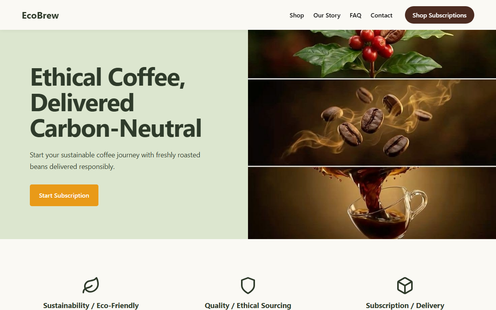
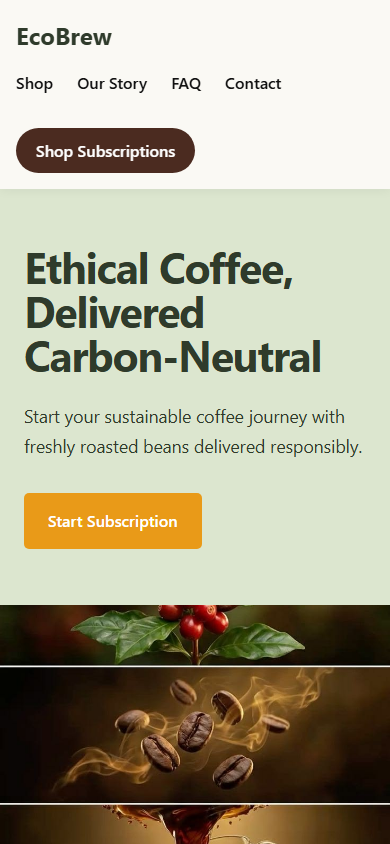

# EcoBrew | Ethical Coffee Subscription

## 1. Project Title
EcoBrew Landing Page

## 2. Task Description
This project is a responsive, static landing page for a fictional ethical coffee subscription brand named "EcoBrew". It demonstrates semantic HTML structure, responsive CSS layout techniques (using Flexbox and Grid), and accessible web design principles. It is built as part of the Oasis Infobyte web development internship.

## 3. Features
- **Responsive Navigation**: A sticky header with accessible navigation links and a clear call-to-action button.
- **Hero Section**: A responsive, two-column layout that gracefully stacks on mobile devices.
- **Services Showcase**: A responsive grid detailing the brand's eco-friendly practices, ethical sourcing, and subscription model.
- **About Section**: An informative section detailing carbon-neutral processes.
- **Testimonials**: A mobile-first grid of sample customer reviews with decorative star ratings.
- **Call-to-Action**: A demonstrational newsletter signup form with a visually hidden, accessible label and responsive email input.
- **Responsive Footer**: Well-organized grid layout of links and brand information.

## 4. Technologies Used
- HTML5
- CSS3 (Custom Properties, Flexbox, CSS Grid)

## 5. Project Folder Structure
```text
RefaisMohamedRimzy_Task1_LandingPage/
├── assets/
│   ├── icons/
│   └── images/
│       ├── desktop-wireframe.png
│       └── mobile-wireframe.png
├── css/
│   └── style.css
├── screenshots/
│   ├── desktop-home.png
│   └── mobile-home.png
├── index.html
└── README.md
```

## 6. How to Run the Project
1. Clone this repository to your local machine.
2. Navigate to `Level-1/RefaisMohamedRimzy_Task1_LandingPage/`.
3. Open `index.html` directly in any modern web browser (e.g., Chrome, Firefox, Edge, Safari). No build tools or local servers are required.

## 7. Challenges and Solutions
- **Responsive Form Elements**: Ensuring the CTA form input and button stretched to full width on mobile while remaining inline on desktop. **Solution**: Utilized CSS Flexbox with a mobile-first approach, setting `flex-direction: column` and `width: 100%` by default, and using a `@media (min-width: 576px)` query to switch to a row layout.
- **Image Accessibility and Fallbacks**: Implementing images that don't break the layout when missing. **Solution**: Used CSS `object-fit: cover` and added `background-color` fallbacks on image elements to maintain structural integrity and ensure readability of alt text.

## 8. What I Learned
- Structuring a complete landing page using only semantic HTML5 without relying on frameworks like Bootstrap.
- Deepened understanding of CSS Grid and Flexbox for creating fluid, mobile-first responsive layouts.
- Implementing accessibility best practices, such as `aria-label` and visually hidden labels for screen readers.

## 9. Screenshots
### Desktop View


### Mobile View


## 10. Author Name
Refais Mohamed Mohamed Ohamed Rimzy

## 11. Internship
Oasis Infobyte Web Development and Designing

## 12. Disclaimer
*Note: EcoBrew, its products, services, and testimonials are entirely fictional and were created solely for educational purposes as part of this internship project. The email signup form is demonstrational and does not store or transmit data.*
