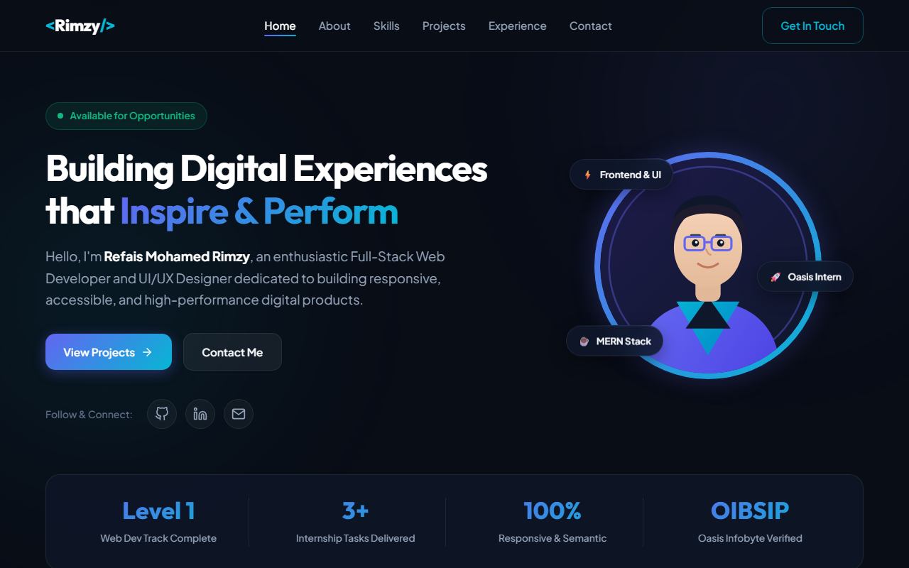
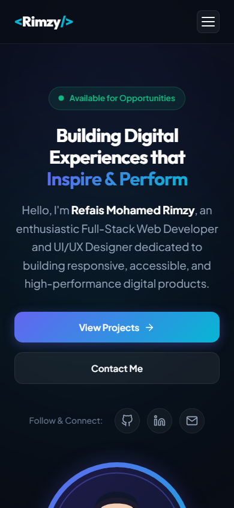

# Personal Portfolio Website | Refais Mohamed Rimzy

## 1. Project Title
Personal Portfolio Website

## 2. Task Description
This project is an interactive, fully responsive personal portfolio website built as part of the **Oasis Infobyte Internship Program (OIBSIP)** under the **Web Development & Designing** track (**Level 1, Task 2**). The website serves as a digital resume and personal showcase highlighting technical proficiencies, engineering philosophy, featured web applications, professional journey, and accessible contact methods.

## 3. Features
- **Hero & Profile Section**: Modern dark-mode aesthetic with avatar graphic, glowing ambient background orbs, status availability pill, title, subtitle, and primary call-to-action buttons.
- **Key Metrics Highlight**: Visual counter cards detailing internship completion metrics, technologies mastered, and web standards adherence.
- **About Me Section**: Comprehensive professional biography covering background, full-stack web development focus, core development pillars (Modern Architecture, Responsive Layouts, Performance, User-Centric Mindset), and personal details.
- **Categorized Skills Matrix**: Visual grid organizing technical proficiencies across Frontend Development, Backend & Storage, and Developer Tools & Workflows.
- **Featured Projects Showcase**: Detailed interactive project cards presenting:
  - **EcoBrew Landing Page** (Oasis Infobyte Level 1, Task 1)
  - **ThermoSphere Smart Temperature Converter** (Oasis Infobyte Level 1, Task 3)
  - **CloudCommerce Full-Stack Platform**
- **Internship & Experience Timeline**: Vertical illuminated timeline highlighting role at Oasis Infobyte and development journey.
- **Interactive Contact Panel**: Real-time validated contact form with client-side regex checks for email syntax, required fields, and visual success alert banner, alongside direct communication links (Email, GitHub, LinkedIn).
- **Sticky Glassmorphism Header & Mobile Drawer**: Smooth scroll navigation with active section detection using `IntersectionObserver` and an accessible mobile hamburger drawer.

## 4. Technologies Used
- **HTML5**: Semantic tags (`<header>`, `<nav>`, `<main>`, `<section>`, `<article>`, `<footer>`, `<form>`), ARIA labels, and SEO meta tags.
- **CSS3**: Custom properties (CSS variables), Flexbox, CSS Grid, glassmorphic backdrop filters, gradient overlays, keyframe animations, and mobile-first responsive media queries.
- **JavaScript (ES6+)**: Vanilla DOM manipulation, IntersectionObserver for active scroll spying, mobile menu state toggling, and input validation without external dependencies.
- **Google Fonts**: Outfit & Plus Jakarta Sans.

## 5. Project Folder Structure
```text
RefaisMohamedRimzy_Task2_Portfolio/
├── css/
│   └── style.css
├── js/
│   └── main.js
├── screenshots/
│   ├── desktop-home.png
│   └── mobile-home.png
├── index.html
└── README.md
```

## 6. How to Run the Project
1. Clone this repository:
   ```bash
   git clone https://github.com/rimzy2002/OIBSIP.git
   ```
2. Navigate to the project directory:
   ```bash
   cd OIBSIP/Level-1/RefaisMohamedRimzy_Task2_Portfolio/
   ```
3. Open `index.html` directly in any modern browser (Chrome, Firefox, Safari, Edge) or use the VS Code Live Server extension. No build step or package installations required.

## 7. Challenges and Solutions
- **Challenge**: Implementing active navigation indicator state synchronization during fast scrolling and trackpad gestures.
  - **Solution**: Employed `IntersectionObserver` with custom viewport root margins (`-30% 0px -60% 0px`) to reliably determine the primary active section in the viewport without expensive scroll event listener polling.
- **Challenge**: Balancing high-end glassmorphic visual aesthetics with cross-browser performance and contrast legibility.
  - **Solution**: Selected WCAG AA compliant contrast ratios with text-to-background combinations, using subtle layered alpha channels (`rgba(15, 23, 42, 0.75)`) and hardware-accelerated transforms for micro-animations.

## 8. What I Learned
- Structuring a comprehensive personal portfolio architecture with zero CSS frameworks.
- Advanced responsive layouts utilizing CSS Grid template areas and flexible Flexbox wraps.
- Implementing accessible and validated form feedback with clean vanilla JavaScript.
- Designing responsive visual mockups and interactive component hierarchies.

## 9. Screenshots
### Desktop View


### Mobile View


## 10. Author Name
**Refais Mohamed Rimzy**  
GitHub: [@rimzy2002](https://github.com/rimzy2002)  
Email: [rimzy2002rr@gmail.com](mailto:rimzy2002rr@gmail.com)

## 11. Internship Track
**Oasis Infobyte Web Development and Designing (OIBSIP)**  
Level: **Level 1** | Task: **Task 2 (Personal Portfolio)**

## 12. Disclaimer
*This project was developed for educational purposes as part of the Oasis Infobyte Web Development and Designing Internship Program. All contact form submissions are processed client-side for demonstration purposes.*
