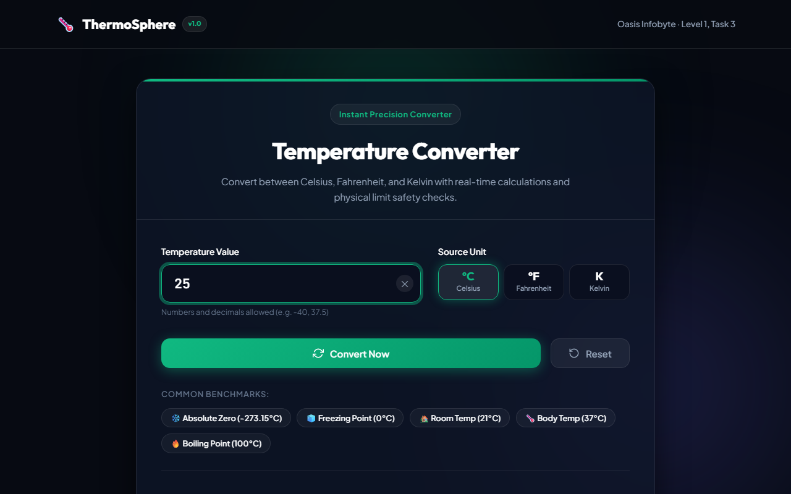
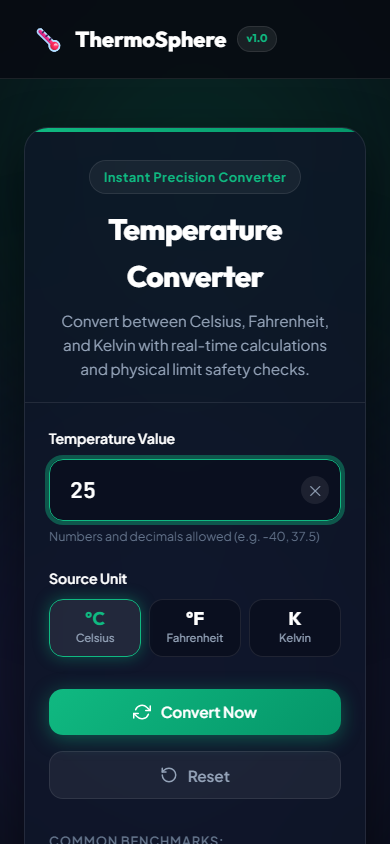

# ThermoSphere | Smart Temperature Converter Website

## 1. Project Title
ThermoSphere — Smart Temperature Converter Website

## 2. Task Description
This project is an interactive, browser-based temperature conversion utility developed as part of the **Oasis Infobyte Internship Program (OIBSIP)** under the **Web Development & Designing** track (**Level 1, Task 3**). It performs instant, highly accurate conversions between the three primary thermodynamic scales: **Celsius (°C)**, **Fahrenheit (°F)**, and **Kelvin (K)**, featuring real-time multi-unit outputs, strict numeric validation, and thermodynamic absolute zero safety checks.

## 3. Features
- **Real-Time & Manual Conversion**: Supports instant calculation on user keystroke as well as explicit evaluation via the "Convert Now" button.
- **Simultaneous Multi-Unit Output Cards**: Displays all three scales simultaneously in dedicated glassmorphic cards with mathematical formula breakdowns.
- **Dynamic Thermal Spectrum Meter**: An animated thermometer visualizer that dynamically shifts width and temperature classification (from Absolute Zero to Boiling and Extreme Heat).
- **Adaptive Theme Background**: The UI background and ambient glow shift dynamically according to temperature warmth (icy cyan for sub-zero, emerald green for room temperature, amber for body temperature, and blazing red for boiling points).
- **Strict Input Validation**: Rejects non-numeric characters, incomplete symbols, or empty submissions with an informative error alert.
- **Absolute Zero Boundary Safeguard**: Detects entries below physical absolute zero (−273.15°C / −459.67°F / 0 K) and presents a thermodynamic educational warning banner.
- **Quick Preset Benchmarks**: Fast one-click shortcuts for fundamental benchmarks:
  - Absolute Zero (−273.15°C)
  - Freezing Point of Water (0°C)
  - Room Temperature (21°C)
  - Human Body Temperature (37°C)
  - Boiling Point of Water (100°C)
- **Built-in Formula Reference**: Integrated formula cheat-sheet card explaining exact conversion arithmetic.
- **Fully Responsive**: Fluid layout optimized for mobile screens, tablets, and desktop workstations.

## 4. Conversion Formulas & Thermodynamic Mathematics
The application executes the following mathematical models:
- **Celsius to Fahrenheit**:
  $$°F = (°C \times 9/5) + 32$$
- **Fahrenheit to Celsius**:
  $$°C = (°F - 32) \times 5/9$$
- **Celsius to Kelvin**:
  $$K = °C + 273.15$$
- **Kelvin to Celsius**:
  $$°C = K - 273.15$$
- **Fahrenheit to Kelvin**:
  $$K = (°F - 32) \times 5/9 + 273.15$$
- **Kelvin to Fahrenheit**:
  $$°F = (K - 273.15) \times 9/5 + 32$$

### Physical Boundaries (Absolute Zero):
- Celsius Limit: $\ge -273.15\,^\circ\text{C}$
- Fahrenheit Limit: $\ge -459.67\,^\circ\text{F}$
- Kelvin Limit: $\ge 0\,\text{K}$

## 5. Technologies Used
- **HTML5**: Semantic document layout, inputmode numeric attributes, and ARIA accessibility roles.
- **CSS3**: Custom properties, Flexbox, CSS Grid, glassmorphism filters, keyframe transitions, and responsive media queries.
- **JavaScript (ES6+)**: Event listeners, dynamic DOM manipulation, mathematical rounding, and validation logic.
- **Google Fonts**: Outfit, Plus Jakarta Sans, and JetBrains Mono.

## 6. Project Folder Structure
```text
RefaisMohamedRimzy_Task3_TemperatureConverter/
├── css/
│   └── style.css
├── js/
│   └── converter.js
├── screenshots/
│   ├── desktop-home.png
│   └── mobile-home.png
├── index.html
└── README.md
```

## 7. How to Run the Project
1. Clone the repository:
   ```bash
   git clone https://github.com/rimzy2002/OIBSIP.git
   ```
2. Navigate to the project directory:
   ```bash
   cd OIBSIP/Level-1/RefaisMohamedRimzy_Task3_TemperatureConverter/
   ```
3. Open `index.html` in any web browser. No installation or compilation steps required.

## 8. Challenges and Solutions
- **Challenge**: Seamlessly updating all output cards while retaining decimal precision without trailing floating-point inaccuracies (e.g., `0.1 + 0.2 = 0.30000000000000004`).
  - **Solution**: Implemented precision rounding via `(Math.round(num * 100) / 100).toFixed(2)` combined with boundary checks.
- **Challenge**: Creating a smooth visual thermometer gauge mapping a wide temperature spectrum from −273.15°C to >100°C.
  - **Solution**: Created a piecewise nonlinear interpolation function that scales different temperature bands realistically to gauge percentages.

## 9. What I Learned
- Building accessible, error-tolerant form controls with vanilla JavaScript.
- Dynamic theme switching via CSS custom properties and state classes.
- Rigorous handling of physics edge cases and input validation patterns.

## 10. Screenshots
### Desktop View


### Mobile View


## 11. Author Name
**Refais Mohamed Rimzy**  
GitHub: [@rimzy2002](https://github.com/rimzy2002)  
Email: [rimzy2002rr@gmail.com](mailto:rimzy2002rr@gmail.com)

## 12. Internship Track
**Oasis Infobyte Web Development and Designing (OIBSIP)**  
Level: **Level 1** | Task: **Task 3 (Temperature Converter Website)**

## 13. Disclaimer
*This web application is developed for educational purposes as part of the Oasis Infobyte Web Development and Designing Internship Program.*
